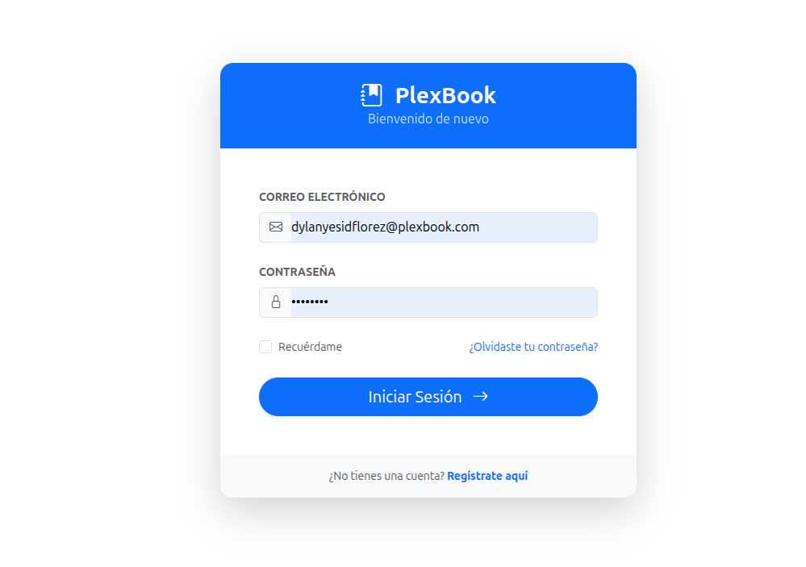
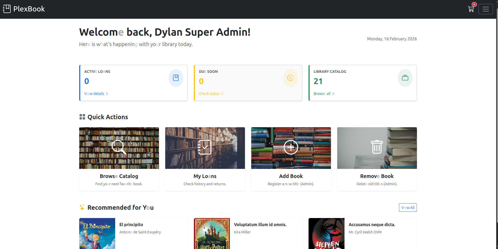
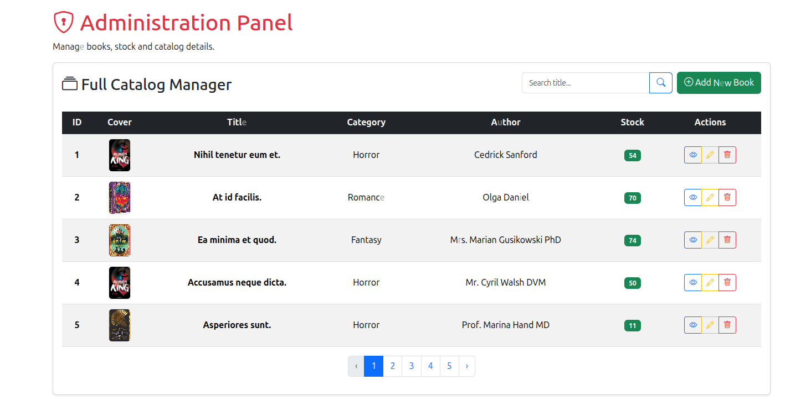
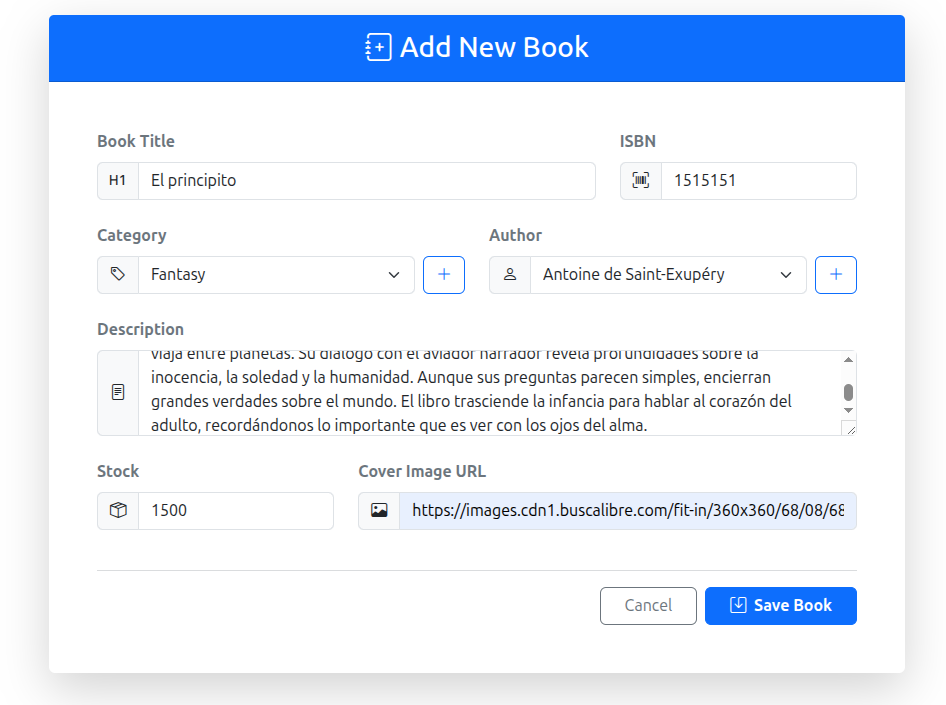
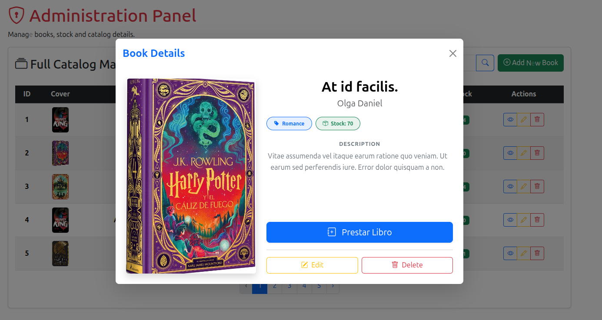
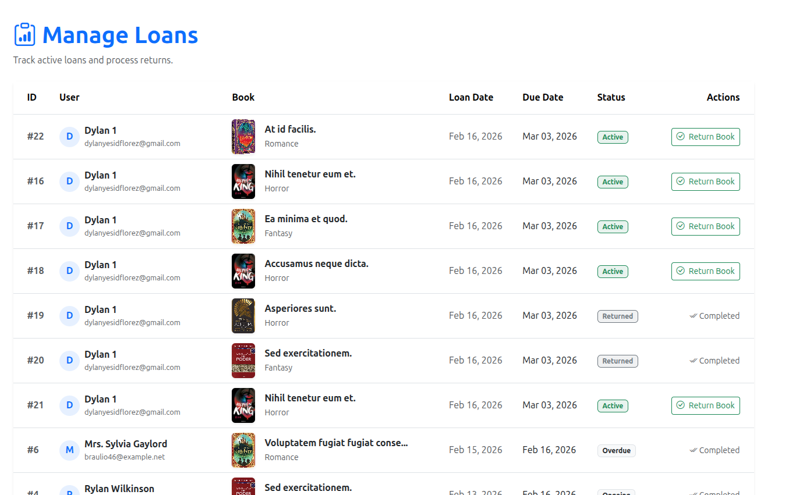

# PlexBook - Library Management System 📚

Welcome to **PlexBook**, a robust Library Management System built with Laravel. This application streamlines library operations, allowing administrators to manage books, authors, categories, and loans efficiently.

## 🚀 Features

### for Administrators 👨‍💼
- **Dashboard**: Real-time overview of active loans, pending returns, and inventory stats.
- **Book Management**:
  - **CRUD Operations**: Create, Read, Update, and Delete books with ease.
  - **Quick Add**: Seamlessly add new Authors and Categories via AJAX modals without leaving the page.
  - **Inventory Tracking**: Automatic stock adjustments on loan and return.
- **Loan Management**:
  - Issue books to users.
  - Process returns with validation logic (prevents double returns).
  - Visual indicators for overdue loans.
- **User Management**: Manage library members and staff roles.

### for Users 👤
- **Catalog Browsing**: Search for books by title or category.
- **My Loans**: View history of borrowed books, due dates, and status.
- **Request Books**: Add books to a personal lending cart for checkout.

## 🛠 Tech Stack

- **Framework**: Laravel 7.x
- **Frontend**: Bootstrap 5, Blade Templates
- **Database**: MySQL
- **Scripting**: jQuery (AJAX operations)

## ⚙️ Installation Guide

Follow these steps to set up the project locally:

1. **Clone the repository**
   ```bash
   git clone https://github.com/Dylancito29/libreria-crud--Laravel-bootstrap.git
   cd libreria-crud--Laravel-bootstrap
   ```

2. **Install Dependencies**
   ```bash
   composer install
   npm install && npm run dev
   ```

3. **Environment Setup**
   ```bash
   cp .env.example .env
   php artisan key:generate
   ```
   *Configure your database settings in the `.env` file.*

4. **Database Migration & Seeding**
   This command sets up the database, roles, and the default Admin user.
   ```bash
   php artisan migrate --seed
   ```

5. **Run the Server**
   ```bash
   php artisan serve
   ```

## 🔑 Demo Credentials

Use this account to log in as an Administrator:

- **Email**: `dylanyesidflorez@plexbook.com`
- **Password**: `Dylan123`

## 📸 Screenshots

Login

Admin Dashboard

Catalog manager (only for admin)

Add new book 

Show a book

Loan manager


---
Made with ❤️ by [Your Name]

## Code of Conduct

In order to ensure that the Laravel community is welcoming to all, please review and abide by the [Code of Conduct](https://laravel.com/docs/contributions#code-of-conduct).

## Security Vulnerabilities

If you discover a security vulnerability within Laravel, please send an e-mail to Taylor Otwell via [taylor@laravel.com](mailto:taylor@laravel.com). All security vulnerabilities will be promptly addressed.

## License

The Laravel framework is open-sourced software licensed under the [MIT license](https://opensource.org/licenses/MIT).
